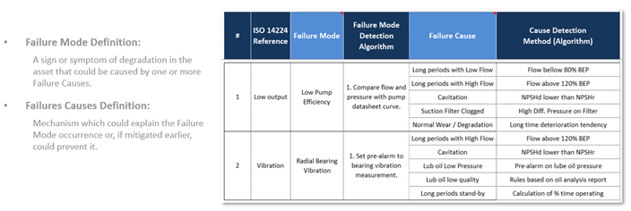
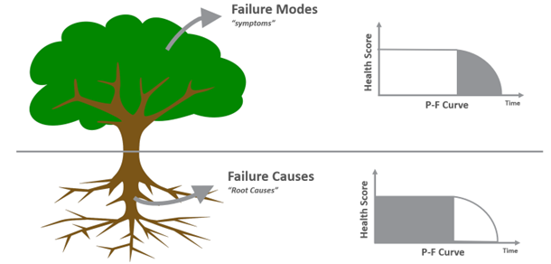

# Phase 2: The Pivot to FMEA-based User Journeys (2022-2024)

Following the validation of the Proof of Concept in Phase 1, the program faced specific challenges related to scalability. The objective was to expand the scope from a pilot set of assets to fleet-wide monitoring. However, a critical structural flaw was identified: the linear relationship between engineering effort and asset count created an unsustainable bottleneck. To overcome this, the team formulated three core hypotheses to guide the program's expansion:

**Hypotheses**
*   **Hypothesis 1 (Relevance & Precision):** Implementing logic derived from Failure Mode and Causes Analysis (FMECA) will improve alarm precision by filtering operational noise and strictly defining "useful alarms" based on engineering context.
*   **Hypothesis 2 (Scalability via Abstraction):** An **Asset-Centric Data Model** (Semantic Layer) is required to decouple analytical logic from raw historian tags. This abstraction is necessary to enable a "Write Once, Deploy Many" architecture, breaking the linear dependency between development effort and asset count.
*   **Hypothesis 3 (Diagnostic Efficiency):** Centralizing all operational context—sensors, active alarms, and documentation—into a unified web interface will significantly reduce time do perform alarm Diagnosis.

**FMECA Integration and Knowledge-Based Models (Addressing Hypothesis 1)**
To address the major problem identified in Phase 1 related to low alert precision driven by a high volume of false alarms, the first hypothesis of Phase 2 focused on redefining what should be considered a useful or actionable alarm from the end-user perspective. Interviews revealed a misalignment between anomalies detected by data-driven models and conditions that engineers associate with meaningful failure development. In the absence of a shared definition, model development had been driven primarily by statistical deviations rather than operational relevance, creating a gap between what was being developed and what effectively supported user decision-making.

A representative example involved a slightly increase in vibration levels in a centrifugal pump that triggered an alarm because the pattern had not been observed in the model training data. Upon evaluation by SMEs, it was reported that the increased vibration could be justified by a significant pump flow temporarily reduction induced by process requirement changes. In such case, although the vibration deviated from its historical baseline, it did not indicate the onset of a vibration-related failure mode and should not be alarming.

To avoid such situations, several workshops were conducted with SMEs to capture their diagnostic reasoning and establish clear definition of alarm relevant. These sessions aimed to define which degradation patterns should be considered indicative of specific failure modes and what contextual information should accompany each alert to expedite their diagnosis phase. This effort was grounded in FMECA approach, with workshops strongly inspired in ISO 13379 series for condition monitoring and diagnostics.

This shift fundamentally changed the approach to algorithm development, where both data-driven and knowledge-based models began to be designed through the lens of specific failure modes. Instead of generic anomaly detection, data-driven models were now trained to recognize patterns associated with defined degradation states. Simultaneously, Knowledge-Based models—utilizing engineering equations and design limits—were integrated to complement these efforts by identifying known failure patterns with high transparency. This unified approach directed the user's attention to specific, actionable issues (e.g., distinguishing "Lube Oil Filter Clogging" from general "Vibration Anomaly") and helped to standardize the definition of a "success case" from simply "catching an anomaly" to "preventing a specific failure mode."

*Figure: FMECA-based logic structure defining the relationship between Failure Modes, Failure Causes, and their respective Detection Algorithms.*

This structured approach relied on precise definitions to guide algorithm development. A **Failure Mode** was defined as the observable sign or symptom of degradation—such as "Low Output" or "High Vibration"—which serves as the initial trigger for investigation. Conversely, a **Failure Cause** represents the underlying mechanism, like "Cavitation" or "Filter Clogging," which explains *why* the failure mode is occurring. By clearly distinguishing between symptoms and root causes, the team could design algorithms that not only flagged anomalies but also provided diagnostic context, enabling engineers to target specific mitigation actions rather than just reacting to generic alerts.

*Figure: Conceptual illustration distinguishing Failure Modes (symptoms) from Failure Causes (root causes), mapped to the P-F Curve.*

This distinction is further illustrated by the P-F Curve. **Failure Modes**, representing the visible symptoms, are situated in the P-F interval—the critical window between the point of detectability (P) and functional failure (F). Detecting these modes allows for timely intervention before total loss of function. In contrast, **Failure Causes** are linked to the latent period *prior* to point P. By identifying and mitigating these root causes (e.g., poor lubrication quality or operating outside design limits), the strategy shifts from detection to prevention, aiming to extend the time before degradation begins or avoiding the point of potential failure altogether.

**The Asset-Centric Data Model (Addressing Hypothesis 2)**
Hypothesis 2 addressed the primary technical bottleneck: the Phase 1 "Direct Tag Binding" architecture. In that initial flat architecture, analytical models were coupled directly to raw sensor tags (e.g., `40_TI_1434.PV`) within the historian database. This created significant friction:
*   **Manual Mapping:** Deploying a model to a new asset required manually locating and hard-coding specific tags, as nomenclature varied significantly between FPSOs.
*   **Fragility:** If a sensor was replaced and its tag name changed, the hard-coded link would break, causing model failure.
*   **Developer Waste:** Developers spent an estimated 80% of their time on tag mapping rather than analytical development.

To resolve this, the team implemented the **Asset-Centric Data Model**, a semantic abstraction layer that functions through a two-step process:
1.  **Normalization:** Raw historian identifiers are mapped once to a standardized "Asset Template." For example, tag `40_TI_1434.PV` is mapped to the standard attribute `Radial Bearing Temp. DE` (Drive End) within the Compressor class.
2.  **Abstraction:** Analytical models are re-written to ingest these standard attributes.

This semantic layer fundamentally changed deployment velocity. By decoupling model logic from the data source, the program achieved a **"Write Once, Deploy Many"** capability. A model defined for a specific equipment class (e.g., Water Injection Pumps) could be instantly instantiated across hundreds of identical assets. This architecture shifted engineering focus from data wrangling to value-added tasks such as model tuning and failure analysis.

**Standardization and Diagnostic Efficiency (Addressing Hypothesis 3)**
Addressing Hypothesis 3, the new application interface leveraged the contextualized data layer to streamline the diagnosis workflow. By aggregating all digital information—real-time sensor trends, historical alarms, and technical documentation—into a single view, the interface eliminated the need for engineers to cross-reference multiple systems.

Metrics tracking user behavior confirmed that this centralization significantly reduced the cognitive load during investigations. These strategic pivots in Phase 2 allowed the program to scale from monitoring hundreds to thousands of assets while simultaneously increasing alarm precision, creating the robust data foundation necessary for the advanced AI integration in Phase 3.
